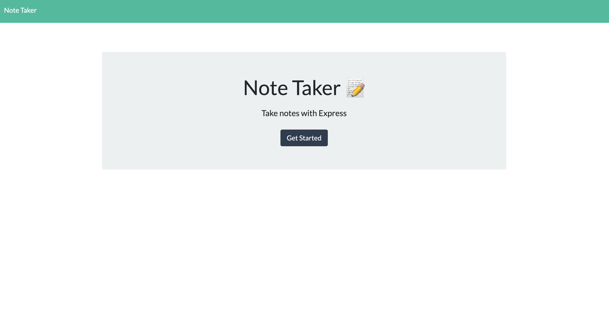
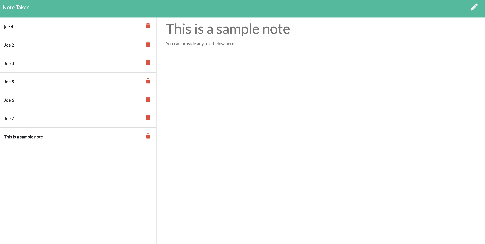

# My Notes App  
  No license is applicable for this application

  ## Description:  
  This application is a web based application which allows a user to write down notes which are then stored to a local JSON file.  The notes application has a form for the note tile and the body of the text.  When the application is loaded, prior notes are populated on the lefthand side.

  
  

  ## Table of Contents:
  * [Installation Instructions](#Installation:)
  * [How to use This Application:](#How-To:)
  * [How to Contibute:](#Contibute:)
  * [License Information:](#License:)
  * [Questions:](#Questions:)
  
  
  ## Installation:  
  To install, clone theis repository and run the 'server.js' file with node.  Then in your browser navigate to localhost:3001.
  
  
  ## How-To:  
  Enter note tile then the text body of the note.  When done click the disk icon in the upper right to save the note.  The note will then be populated to the left side of the screen.  Notes are saved, and in order to access and edit old notes, simply click on the note on the left side and then edit in the main section of the webpage.  After editing, click the save icon again.  To delete notes click the trash icon next the note you wish to delete then restart the application in node.
  
  The application can also be accessed on heroku by the following link:
  https://lit-beach-81656.herokuapp.com/

  
  ## Contribute:  
  If you would like to contribute to this application please contact me below.

  
  ## License:  
  This application is covered under the following license...
  No License  
  For more information on the license click on the badge below:
  No license is applicable for this application
  
  
  ## Questions:  
  For questions, comments, suggestions, I can be reached at the following  
  https://github.com/hansonjw  
  hansonjw@gmail.com
